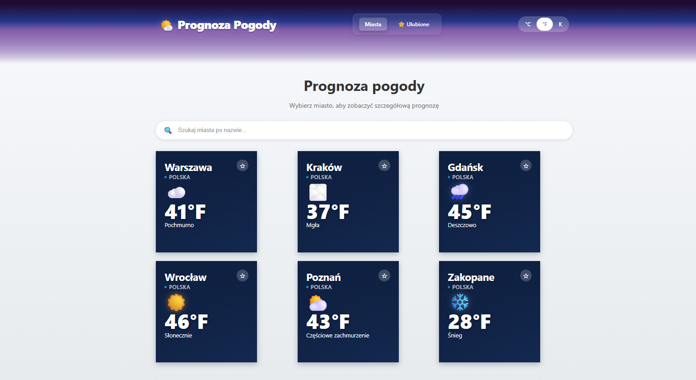

# Aplikacja Pogodowa

Prosta aplikacja pogodowa zbudowana w React, która umożliwia sprawdzenie aktualnej pogody i prognozy na 5 dni dla wybranych miast w Polsce.

## Funkcjonalności

*   **Lista miast**: Przegląd pogody dla głównych miast w Polsce (Warszawa, Kraków, Gdańsk, Wrocław, Poznań, Zakopane).
*   **Wyszukiwarka**: Możliwość wyszukania dowolnego miasta po nazwie.
*   **Widok szczegółowy**: Po kliknięciu w miasto wyświetlane są szczegółowe informacje, takie jak:
    *   Temperatura
    *   Opis pogody (pochmurno, deszcz, śnieg itp.)
    *   Opady
    *   Prędkość i kierunek wiatru
    *   Zachmurzenie
    *   Wilgotność
*   **Prognoza 5-dniowa**: Przełącznik między widokiem "Teraz" a "Prognoza 5 dni".

## Zrzuty ekranu

### Widok listy miast
Główny ekran aplikacji z listą zapisanych lokalizacji.


*(Uwaga: Upewnij się, że plik obrazu znajduje się w głównym katalogu projektu, aby ścieżka działała poprawnie.)*

### Widok szczegółowy miasta
Szczegółowe informacje pogodowe po wybraniu miasta (np. Warszawy).


*(Uwaga: Upewnij się, że plik obrazu znajduje się w głównym katalogu projektu, aby ścieżka działała poprawnie.)*

## Jak uruchomić projekt lokalnie?

1.  **Sklonuj repozytorium**
    ```bash
    git clone https://github.com/MasRafal/weather-app.git
